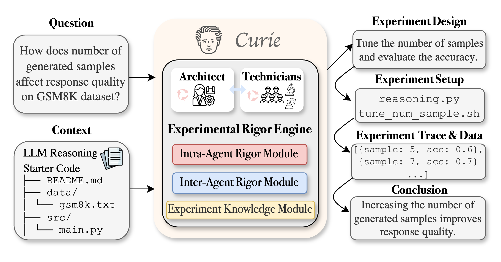

# Curie: A Research Experimentation Agent

[](https://arxiv.org/abs/2502.16069)
[](https://join.slack.com/t/just-curieous/shared_invite/zt-313elxhhy-hpEK5r9kX9Xv1Pfxzt9CJQ)
[](http://44.202.70.8:5000/)
[](https://www.just-curieous.com/)
[](LICENSE)
[](https://pypi.org/project/curie-ai/)

<p align="center">
  
</p>

## Overview

Curie is the first AI-agent framework designed for automated and rigorous scientific experimentation. It helps answer your curiosity through end-to-end experimentation automation, ensuring that every step—from hypothesis formulation to result interpretation—is conducted with precision, reliability, and reproducibility.

Our mission is to empower scientists to **move research at the speed of thought**.

## Key Features

- 🚀 **Automated Experimentation** – End-to-end process from hypothesis formulation to result analysis
- 📊 **Rigor Enhancement** - Built-in verification modules for methodical procedures and reproducibility
- 🔬 **Broad Applicability** – Supports ML research, system analysis, and scientific discovery
 
## Installation

#### Option 1: Quick Install via pip
```bash
pip install curie-ai
```

#### Option 2: Manual [Installation](./docs/installation.md)
1. Install Docker:
   ```bash
   # Install Docker from https://docs.docker.com/engine/install/ubuntu/
   sudo chmod 666 /var/run/docker.sock
   docker ps  # Verify Docker installation
   ```

2. Clone and setup:
   ```bash
   git clone https://github.com/Just-Curieous/Curie.git
   cd Curie
   ```

3. Configure API credentials in `curie/setup/env.sh`:
   ```bash
   export MODEL="claude-3-7-sonnet-20250219" 
   export ANTHROPIC_API_KEY="your-anthropic-key"
   ```

4. Build container:
   ```bash
   pip install -e .
   docker images -q exp-agent-image | xargs -r docker rmi -f
   cd curie && docker build --no-cache --progress=plain -t exp-agent-image -f ExpDockerfile_default .. && cd -
   ```


## Examples

### Example 1: You Have a Single Question that Needs to be Verified.
```python
import curie

# Set up your API keys
key_dict = {
    "MODEL": "claude-3-7-sonnet-20250219",
    "ANTHROPIC_API_KEY": "your-anthropic-key"
}

# Run experiments to understand the Sorting Algorithm Efficiency.
result = curie.experiment(
    api_keys=key_dict,
    question="How does the choice of sorting algorithm impact runtime performance across different input distributions?"
)
``` 
- **Auto-generated Experiment report**: Available [ `logs/research_<ID>.md`](./docs/example_logs/sorting_example/research_1747978647_20250523013727_iter1.md).
- **Reproducibilty and Logs**:
  - The full experimentation process (script to reproduce results, generated code and experiment results) is saved in `workspace/research_<ID>/`.
  - Real-time logs are streamed to the console and stored in file `research_*.log`.


### Example 2: Dataset Analysis 
I have a dataset and some starter code,and I want to train/deloy ML models to achieve my goals.

```python
import curie

# Set up your API keys
key_dict = {
    "MODEL": "claude-3-7-sonnet-20250219",
    "ANTHROPIC_API_KEY": "your-anthropic-key"
}

# Run experiments to understand the Sorting Algorithm Efficiency.
result = curie.experiment(
    api_keys=key_dict,
    question="E.g. How to improve my prediction accuracy on my dataset.",
    workspace_name="[optional] abs_path_to_codebase_dir",
    dataset_dir="abs_path_to_dataset_dir"
)
``` 

Checkout more usage instruction in the development [guide](./docs/development.md).
 

## Use Cases
Check out how Curie solves [machine learning tasks](./benchmark/mle_bench/) from [MLE-Bench](https://github.com/openai/mle-bench) and find optimal ML solutions.
  - [Predict the dog breed](./benchmark/mle_bench/dog-breed-identification/)
  - [Identify melanoma in images of skin lesions](./benchmark/mle_bench/siim-isic-melanoma-classification/)
  - [Predict the severity level of diabetic retinopathy based on retinal images](./benchmark/mle_bench/aptos2019-blindness-detection/)
  - [Histopathologic Cancer Detection](./benchmark/mle_bench/histopathologic-cancer-detection/)
  - [Predict the stock price ranking](https://github.com/Just-Curieous/Curie-Use-Cases/tree/main/stock_prediction)
  - Check out more [Machine Learning Use Cases](https://github.com/Just-Curieous/Curie-Use-Cases).

**Sample auto-generated experiment [report](./benchmark/mle_bench/aptos2019-blindness-detection/report.pdf)**:


<!-- First row with 3 images -->
<p align="center">


</p>
<!-- Second row with 3 images -->
<p align="left">


</p>


<!-- ## Documentation -->

<!-- - [Installation Guide](./docs/installation.md) -->
<!-- - [Quick Start Guide](./docs/quick_start.md) -->
<!-- - [Tutorial: Working with Your Own Starter Files](./docs/tutorial_with_your_own_starter_file.md) -->
<!-- - [Tutorial: Large Language Monkeys Reproduction](./docs/tutorial-large-language-monkey.md) -->

## Demo Video

[](https://www.youtube.com/watch?v=Qn_T5mm2OP4)

## Community and Support

- [GitHub Issues](https://github.com/Just-Curieous/curie/issues) - Report bugs or request features
- [Schedule a Meeting](https://calendly.com/amberljc/30min) - Get help from our team
- [Join our Slack Community](https://join.slack.com/t/just-curieous/shared_invite/zt-313elxhhy-hpEK5r9kX9Xv1Pfxzt9CJQ)

## License

This project is licensed under the Apache 2.0 License - see the [LICENSE](LICENSE) file for details.