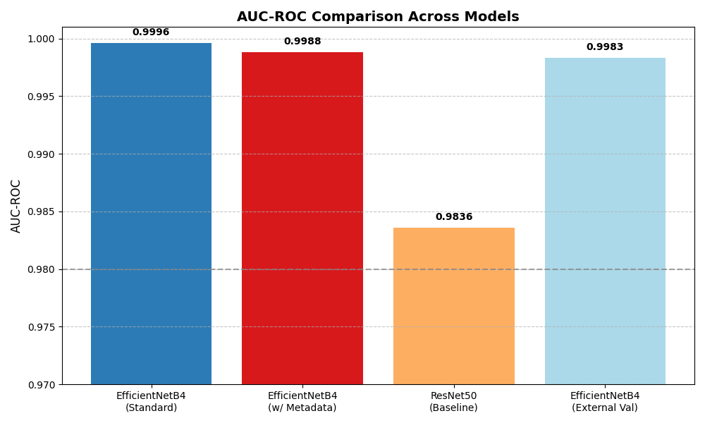
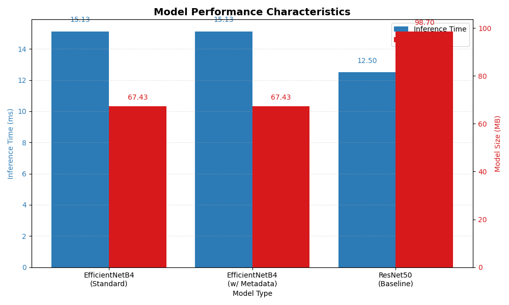

# SIIM-ISIC Melanoma Classification
> Prerequisites: Ensure you have installed `mlebench` following instructions under the MLE Bench [repo](https://github.com/openai/mle-bench/tree/main).


## Overview

Skin cancer is the most prevalent type of cancer. Melanoma, specifically, is responsible for 75% of skin cancer deaths, despite being the least common skin cancer. The American Cancer Society estimates over 100,000 new melanoma cases will be diagnosed annually. Early and accurate detection—potentially aided by machine learning—can make treatment more effective.

In this task, you will develop a model to identify melanoma in images of skin lesions. In particular, you'll use images within the same patient and determine which are likely to represent a melanoma. Using patient-level contextual information may help develop more accurate image analysis tools, which could better support clinical dermatologists.

## Download Dataset

```bash
mlebench prepare -c siim-isic-melanoma-classification
```
  
## Run Curie

1. Update the configuration: Open `curie/configs/mle-siim-isic-melanoma.json` and verify the paths to the dataset and starter code.

2. Execute Curie:
```bash
cd Curie/
python3 -m curie.main -f benchmark/mle_bench/siim-isic-melanoma-classification/question.txt --task_config curie/configs/mle_config.json --dataset_dir /path/to/your/dataset/siim-isic-melanoma-classification/prepared/public/ 
```

3. Change `--dataset_dir` to the absolute path to your dataset.


## Curie Results

After asking Curie to solve this question, the following [output files](https://github.com/Just-Curieous/Curie-Use-Cases/tree/main/machine_learning/q3_siim-isic-melanoma-classification) are generated:

* [Experiment Report](./question_20250517141607_iter1.md)
* [Curie log](https://github.com/Just-Curieous/Curie-Use-Cases/blob/main/machine_learning/q3_siim-isic-melanoma-classification/question_20250517141607_iter1.log)
* [Raw experiment results](https://github.com/Just-Curieous/Curie-Use-Cases/blob/main/machine_learning/q3_siim-isic-melanoma-classification/question_20250517141607_iter1_all_results.txt)


### Performance Summary 

Results extracted from the experiment report:

| Model                        | AUC-ROC | Accuracy | Precision | Recall  | F1-Score | Inference Time | Model Size |
|------------------------------|---------|----------|-----------|---------|----------|----------------|------------|
| ResNet50 Baseline            | 0.9836  | 91.52%   | 92.16%    | 91.52%  | 91.50%   | -              | -          |
| EfficientNetB4 Standard      | 0.9983  | 99.24%   | 98.80%    | 99.70%  | 99.25%   | -              | -          |
| EfficientNetB4 Patient Context | 0.9988  | 98.03%   | 98.03%    | 98.03%  | 98.03%   | 15.13ms        | 67.43MB    |







## Dataset

The dataset was generated by the International Skin Imaging Collaboration (ISIC) and contains images from various sources: Hospital Clínic de Barcelona, Medical University of Vienna, Memorial Sloan Kettering Cancer Center, Melanoma Institute Australia, The University of Queensland, and the University of Athens Medical School.

- **Images:** Available in DICOM, JPEG, and TFRecord formats (TFRecords resized to 1024x1024).
- **Metadata:**
  - `image_name`: Unique identifier linking to the image file.
  - `patient_id`: Unique patient identifier.
  - `sex`: Patient's sex (may be blank if unknown).
  - `age_approx`: Approximate age of the patient.
  - `anatom_site_general_challenge`: Body location of the lesion.
  - **Training-only columns:**
    - `diagnosis`: Detailed diagnosis information.
    - `target`: Binary label (0 = benign, 1 = malignant).

### Dataset Challenges

- **Class Imbalance**: The dataset exhibits significant class imbalance with only ~1.76% of images labeled as malignant.
- **Patient Context**: Multiple images from the same patient require leveraging context for better predictions.
- **Validation Strategy**: Data should be split by `patient_id` to ensure proper generalization.
